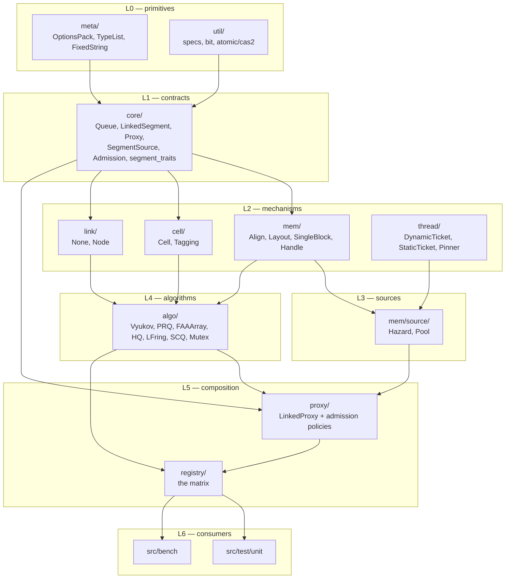
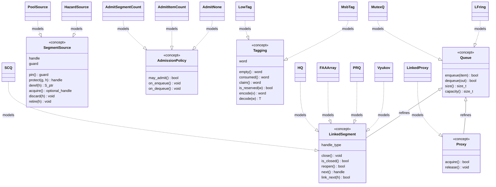
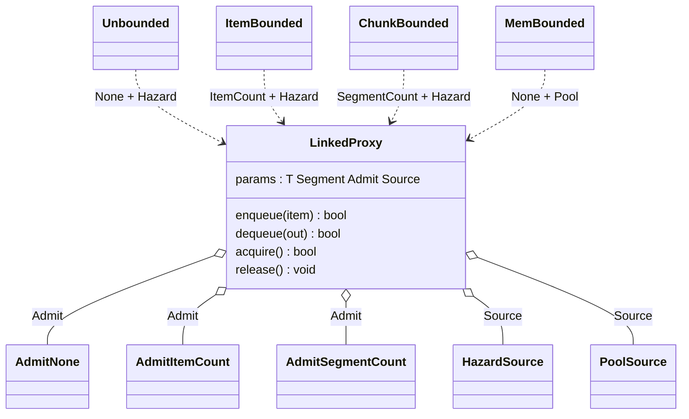

# Abstraction Map — Composable, Vtable-Free Queue Architecture

> **This is the plan, not the outcome.** It was written before implementation and several
> of its specifics changed while being built — `AnyQueue` was dropped entirely, `namespace
> link` became `linkage`, `may_admit` became `try_admit`/`cancel_admit`, `queue::LFring`
> became `queue::IndexRing`, and `Pool` ended up owning its reclamation rather than wrapping
> `Recycler`. See **[[As Shipped]]** for the design that exists and a table of every
> deviation. The UML, the layering and the reasoning below are still accurate and are why
> this note is kept.

Companion to [[Architecture Patterns]], which diagnosed what is wrong with the current tree. This
note designs the replacement: the full set of abstractions, a UML view of how they compose, the
target file layout, and the order in which to get there.

Related: [[Queue Interfaces]] (superseded), [[Recycled Queue]],
[[Queue Architecture for Bounded and Unbounded Segments]], [[Epoch-Based Segment Recycler]],
[[Hazard]], [[Queue Storage Policies]].

> **The code in this note is a design sketch. None of it has been compiled.** Statements about the
> *current* tree carry a `file:line` and were verified; statements about the *proposed* tree are
> design intent. The same caveat applies to §4 of [[Architecture Patterns]].

---

## 1. Constraints and decisions

**Hard constraint: no vtable polymorphism anywhere.** No `virtual`, no type erasure, no
`std::function`, no `std::variant` dispatch. All composition is by template parameter, all contracts
by concept, all branching by `if constexpr`.

This **supersedes §4.1 of [[Architecture Patterns]]**, which proposed an `AnyQueue<T>` type-erasure
wrapper for the benchmark. `AnyQueue` is a hand-rolled vtable and is now out of scope. Runtime
selection moves to compile time — see §9.

Three decisions drive the design:

| Decision | Choice | Status |
| --- | --- | --- |
| Cell tagging | Extract a `Tagging` policy unifying the three reserved-value schemes | **chosen by user** |
| Benchmark dispatch | Compile-time fold over the registry; one binary | *assumed* — see below |
| Standalone vs linked | One algorithm body, parameterized by a `Linkage` policy | *assumed* — see below |

*On dispatch:* the fold instantiates the whole matrix in one TU. With `-O3 -flto=auto
-march=native` (`CMakeLists.txt:21-28`) that will get slow as the matrix grows. The fallback, if it
does, is a CMake `foreach` over the registry emitting one target per entry — smaller binaries,
faster incremental builds, at the cost of a CMake-side list that must track the C++ one. The
registry design in §9 supports either without change.

*On linkage:* the alternative is keeping standalone and linked as separate classes, which is simpler
to read but writes each algorithm twice — the drift between `VyukovBuffer` and `VyukovDCAS`
(`VyukovDCAS.hpp:36-48` re-implements `bit::is_pow2`/`round_to_next_pow2`) is what that costs.

---

## 2. Layer map

Strictly acyclic. `core/` holds only concepts and depends on nothing but the standard library.



The rule that keeps it acyclic: **`core/` names no implementation**. Today the reverse holds —
`base::IProxy` (`IProxy.hpp:16`) inherits `base::IQueue` *and* instantiates a segment
(`Seg<T,void,SegmentOpt,void>`, `UnboundedProxy.hpp:26`) purely to run a static assert, so the
contract layer depends on the implementation layer.

---

## 3. The concept set

Six concepts and one traits block. Each replaces a specific ad-hoc mechanism.

| Concept | Replaces |
| --- | --- |
| `core::Queue` | `base::IQueue` (`IQueue.hpp:17`) |
| `core::LinkedSegment` | `base::ILinkedSegment` (`ILinkedSegment.hpp:21`) + the protected `next` member |
| `core::Proxy` | `base::IProxy` (`IProxy.hpp:16`) |
| `core::SegmentSource` | `HazardVector` / `Recycler` used directly and non-interchangeably |
| `core::AdmissionPolicy` | `capacity_respected_`, written twice differently |
| `cell::Tagging` | three reserved-value schemes (§8) |
| `core::segment_traits` | `info_required`, the `requires(...)` probe, three `void_t` tags |

### 3.1 `core::Queue`

```cpp
namespace core {

template<typename Q, typename T>
concept Queue =
    requires (Q q, const Q cq, T item, T& out) {
        { q.enqueue(item) } noexcept -> std::same_as<bool>;
        { q.dequeue(out)  } noexcept -> std::same_as<bool>;
        { cq.size()       } noexcept -> std::same_as<std::size_t>;
        { cq.capacity()   } noexcept -> std::same_as<std::size_t>;
    };

} // namespace core
```

`size()` is in the contract for *every* queue. Today it is in `IQueue` but not `ILinkedSegment`, so
`LinkedVyukov` inherits a virtual one, `LinkedPRQ.hpp:120` and `LinkedFAAArray.hpp:98` each declare a
private non-virtual one, and `LinkedSCQ` has none — the same call means three different things.

### 3.2 `core::LinkedSegment`

```cpp
template<typename S, typename T>
concept LinkedSegment =
    Queue<S, T> &&
    requires (S s, const S cs, typename S::handle_type h) {
        typename S::handle_type;                                    // S* or VersionedIndex

        { s.close()          } noexcept -> std::same_as<void>;
        { cs.is_closed()     } noexcept -> std::same_as<bool>;
        { s.reopen()         } noexcept -> std::same_as<bool>;      // false => not recyclable

        { cs.next()          } noexcept -> std::same_as<typename S::handle_type>;
        { s.link_next(h)     } noexcept -> std::same_as<bool>;      // CAS nil -> h, once
    };

/// Optional extension: only required when segment_traits<S>::needs_close_hint.
template<typename S, typename T>
concept HintedSegment =
    LinkedSegment<S, T> &&
    requires (S s, T item) {
        { s.enqueue(item, bool{}) } noexcept -> std::same_as<bool>;
    };
```

Three things change from `ILinkedSegment`.

**`next` gets accessors.** `next()` / `link_next()` enter the contract, so the proxy stops reaching
into a protected data member — today `UnboundedProxy.hpp:92` does `tail->next.load(...)` and
`:117` `tail->next.compare_exchange_strong(...)` against the member declared at
`ILinkedSegment.hpp:27`. The linked-list invariant is currently maintained by two classes editing one
variable. This is also exactly why `LinkedHQ` no longer composes: it has `getNext()` and its own
`next_` (`HQSegment.hpp:67,199`), which is a *different spelling of the same idea*. With accessors in
the contract, it conforms.

**The `info` hint leaves the base arity.** Today every segment writes a forwarding overload to drop
a parameter it ignores, with an inconsistent default — `true` in `LinkedVyukov.hpp:111` and
`LinkedSCQ.hpp:82`, `false` in `LinkedPRQ.hpp:143` and `LinkedFAAArray.hpp:123`. As an optional
extension it exists only on the one segment that needs it.

**`reopen()` returns `bool`.** `LinkedFAAArray::open()` is `assert(false && "TODO")`
(`LinkedFAAArray.hpp:117`) — a runtime abort standing in for "this segment cannot be recycled". As a
return value plus a `recyclable` trait it becomes a fact the type system carries.

### 3.3 `core::segment_traits`

```cpp
template<typename S> struct segment_traits;   // deliberately left undefined

template<typename T, typename Opt, typename Link>
struct segment_traits<algo::SCQ<T, Opt, Link>> {
    static constexpr bool needs_close_hint      = true;   // was ILinkedSegment::info_required
    static constexpr bool needs_dequeue_prepare = true;   // was the requires(...) probe
    static constexpr bool recyclable            = true;
    static constexpr bool can_store_null        = true;
};
```

**No primary definition.** A segment with no specialization fails to compile at first use, naming
the missing specialization. Contrast the three mechanisms it replaces, all of which fail *silently*:
`info_required` defaults to `false` via inheritance (`ILinkedSegment.hpp:37`); the `requires(...)`
probe — copy-pasted into all four proxies at `UnboundedProxy.hpp:38`, `BoundedCounterProxy.hpp:35`,
`BoundedChunkProxy.hpp:37`, `BoundedMemProxy.hpp:62` — silently does nothing if the method is
renamed; `is_co_allocated_v` silently answers `false` on a misspelled tag, which is live Bug B.

`needs_dequeue_prepare` finally gets its reason recorded next to it. What it works around: `SCQ` is
built from two `LFring`s (`SCQueue.hpp:41-42`), and `LFring` keeps a *threshold* counter to make its
empty-check cheap. Once a successor is linked, the head segment must be drained exhaustively before
unlinking, so the threshold must be reset first or the retry at `UnboundedProxy.hpp:154` reports
empty while items remain (`LinkedSCQ.hpp:58` → `LFring.hpp:55`). Today that reasoning exists only as
the comment *"This is a hack for LinkedSCQ"*, four times.

### 3.4 `core::SegmentSource` — the unifying abstraction

This is the load-bearing idea of the whole design.

```cpp
template<typename Src, typename S>
concept SegmentSource =
    requires (Src src, typename Src::handle h, typename Src::guard& g) {
        typename Src::handle;      // S* or VersionedIndex
        typename Src::guard;       // RAII protection scope

        { Src::nil()               } noexcept -> std::same_as<typename Src::handle>;
        { src.pin()                } noexcept -> std::same_as<typename Src::guard>;
        { src.protect(g, h)        } noexcept -> std::same_as<typename Src::handle>;
        { src.deref(h)             } noexcept -> std::same_as<S*>;

        { src.acquire()            }          -> std::same_as<std::optional<typename Src::handle>>;
        { src.discard(h)           } noexcept -> std::same_as<void>;   // never published
        { src.retire(h)            } noexcept -> std::same_as<void>;   // was published

        { src.register_thread()    } noexcept -> std::same_as<bool>;
        { src.unregister_thread()  } noexcept -> std::same_as<void>;
    };
```

Two models:

| | `mem::source::Hazard~S~` | `mem::source::Pool~S, N~` |
| --- | --- | --- |
| `handle` | `S*` | `VersionedIndex` |
| `guard` | hazard-pointer slot, RAII | epoch pin, RAII |
| `acquire()` | `SingleBlock::create` — always succeeds | draw from pool — **`nullopt` when exhausted** |
| `discard(h)` | `SingleBlock::destroy` immediately | return to free bucket immediately |
| `retire(h)` | hazard scan, then destroy | defer to epoch, then reuse |
| backed by | `HazardVector` | `Recycler` + `ImmutablePtrLookup` |

**Why this collapses `BoundedMemProxy` out of existence.** That proxy is a separate 288-line file
only because its bound is enforced differently. But its bound **is its pool size**:
`Recycler<Segment, ChunkFactor, ...>` pre-allocates `Capacity = ChunkFactor` segments into an
`ImmutablePtrLookup` (`Recycler.hpp:54,80,322`), and enqueue fails exactly when no index is free. It
is not an admission policy at all — it is a source that can run out. Once `acquire()` returns
`optional`, the memory bound is expressed by the source and `BoundedMemProxy` becomes
`admit::None` + `source::Pool`.

`discard` vs `retire` is a real distinction the current code makes implicitly: `UnboundedProxy.hpp:122`
`delete`s a losing new tail directly, with no hazard scan, because no other thread ever saw it. The
item is not lost — `item` is still a local and the loop retries. Making that a named operation stops
it being an accident.

### 3.5 `core::AdmissionPolicy` and `core::Proxy`

```cpp
template<typename A>
concept AdmissionPolicy =
    requires (A a, const A ca) {
        { ca.may_admit()  } noexcept -> std::same_as<bool>;
        { a.on_enqueue()  } noexcept -> std::same_as<void>;
        { a.on_dequeue()  } noexcept -> std::same_as<void>;
        { ca.bound()      } noexcept -> std::same_as<std::size_t>;   // 0 == unbounded
    };

template<typename P, typename T>
concept Proxy =
    Queue<P, T> &&
    requires (P p) {
        { p.acquire() } noexcept -> std::same_as<bool>;
        { p.release() } noexcept -> std::same_as<void>;
    };
```

Three policies suffice:

| Policy | `may_admit()` | Replaces |
| --- | --- | --- |
| `admit::None` | `true` (empty struct) | `UnboundedProxy` |
| `admit::ItemCount` | `pushed - popped < cap` | `BoundedCounterProxy.hpp:254` |
| `admit::SegmentCount` | `tail_idx - head_idx + 1 < k` | `BoundedChunkProxy.hpp:275` |

`admit::None` is empty and sits under `[[no_unique_address]]`, so the unbounded proxy pays nothing.

### 3.6 Concepts and their models



Note what the diagram does **not** contain: no abstract base class, no virtual dispatch. Every
`..|>` is concept satisfaction checked at compile time, and every `<|--` between concepts is
refinement (`LinkedSegment` requires `Queue`), not inheritance.

---

## 4. Memory: co-allocation

### 4.1 Layout must express N regions

`SCQueue.hpp:50-61` carves **three** regions from one block — two `LFring`s and a `T` buffer — using
`LFring`'s bump-allocator overload `create(cap, inj_memory, remaining_size)` (`LFring.hpp:123`),
which mutates a running size and returns the next free address:

```cpp
void *f_ptr = mem;
void *d_ptr = LFringType::template create<true >(lf_cap, f_ptr, total);
void *b_ptr = LFringType::template create<false>(lf_cap, d_ptr, total);
```

A "header + one trailing array" model cannot express this. Replace it with a declarative plan
computed once, at compile time where possible:

```cpp
namespace mem {

constexpr std::size_t align_up(std::size_t n, std::size_t a) noexcept {
    return (n + a - 1) & ~(a - 1);          // the ONLY copy in the tree
}

struct Region { std::size_t offset, bytes; };

class LayoutBuilder {
    std::size_t cursor_, align_;
public:
    constexpr LayoutBuilder(std::size_t header_bytes, std::size_t header_align) noexcept
        : cursor_{header_bytes}, align_{header_align} {}

    constexpr Region add(std::size_t bytes, std::size_t a) noexcept {
        cursor_ = align_up(cursor_, a);
        align_  = a > align_ ? a : align_;
        Region r{cursor_, bytes};
        cursor_ += bytes;
        return r;
    }
    constexpr std::size_t total()       const noexcept { return align_up(cursor_, CACHE_LINE); }
    constexpr std::size_t block_align() const noexcept { return align_ > CACHE_LINE ? align_ : CACHE_LINE; }
};

} // namespace mem
```

A segment declares its own plan. Single-array case:

```cpp
struct Plan { mem::Region cells; std::size_t total, block_align; };

static constexpr Plan plan(std::size_t n) noexcept {
    mem::LayoutBuilder b{sizeof(Self), alignof(Self)};
    Plan p{};
    p.cells       = b.add(n * sizeof(Cell), alignof(Cell));
    p.total       = b.total();
    p.block_align = b.block_align();
    return p;
}
```

Three-region case (SCQ) is the same shape with three `add` calls, and the bump-allocator overload of
`LFring::create` disappears entirely.

### 4.2 `SingleBlock` — the only allocator

```cpp
template<typename Derived>
struct SingleBlock {                                    // CRTP, non-virtual
    template<typename... A>
    [[nodiscard]] static Derived* create(std::size_t n, A&&... a) {
        const auto p = Derived::plan(n);
        void* raw = std::aligned_alloc(p.block_align, p.total);
        if (!raw) throw std::bad_alloc();
        return new (raw) Derived(n, Blocks{raw, p}, std::forward<A>(a)...);
    }
    static void destroy(Derived* d) noexcept {
        if (!d) return;
        d->~Derived();
        std::free(d);
    }
};
```

What this deletes, in one move:

- the **seven** hand-rolled `create()`s (`LinkedVyukov.hpp:57`, `LinkedPRQ.hpp:83`,
  `LinkedFAAArray.hpp:69`, `LinkedSCQ.hpp:37`, `HQSegment.hpp:100`, `SCQueue.hpp:70`, `LFring.hpp:114`);
- the **five** `owns_buffer` flags and their dual constructors;
- the **five** duplicated `operator delete(void*)` / `operator delete(void*, align_val_t)` pairs —
  26 identical lines, five times;
- **Bug A**, because `mem::align_up` is the only align-up and it is correct. The buggy
  `& (~alignof(Cell) - 1)` at `LinkedPRQ.hpp:85`, `LinkedFAAArray.hpp:71` and `LFring.hpp:101` has no
  surviving copy;
- **Bug B**, because *deriving from `SingleBlock` is the opt-in*. There is no `IsCoAllocated` /
  `isCoAllocated` tag to misspell (`LinkedVyukov.hpp:52` vs `LinkedFAAArray.hpp:68`); a segment that
  does not derive simply has no `create()`, which is a compile error at the call site rather than a
  silent fallback to `new`.

Because `plan()` is `constexpr`, region non-overlap becomes a `static_assert` on a representative
instantiation rather than something you hope holds. That is the permanent regression guard for Bug A
— write it before the fix, watch it fail, then fix.

There is no `operator delete`: construction is `create`-only, and ownership is expressed as
`std::unique_ptr<S, mem::Destroy<S>>` where a proxy holds one directly.

### 4.3 Handle-type circularity

The `next` field's type depends on the **source**, not the segment — which is exactly why the
current code carries a fourth `NextT` template parameter (`LinkedVyukov.hpp:26`). Resolve it with a
handle policy; `S*` naming its own enclosing incomplete type is legal:

```cpp
namespace mem {
struct VersionedIndex { /* 32-bit version | 32-bit index — ONE definition */ };

struct PtrHandle   { template<typename S> using type = S*;             };
struct IndexHandle { template<typename S> using type = VersionedIndex; };
}
```

`link::Node<HandlePolicy>` supplies `handle_type` to the algorithm; the source dictates the policy.
`VersionedIndex` is currently defined **twice** — at global scope in `BoundedMemProxy.hpp:18` and
again in the dead `util/hazard/Recycler/VersionedIndex.hpp`.

### 4.4 Memory subsystem

```mermaid
classDiagram
    class align_up {
        <<function>>
        align_up(n, a) size_t
    }
    class LayoutBuilder {
        add(bytes, align) Region
        total() size_t
        block_align() size_t
    }
    class Region {
        offset : size_t
        bytes : size_t
    }
    class SingleBlock {
        <<CRTP base>>
        create(n, args) Derived_ptr
        destroy(d) void
    }

    LayoutBuilder ..> align_up : uses
    LayoutBuilder --> Region : produces
    SingleBlock ..> LayoutBuilder : via Derived::plan

    class PtrHandle
    class IndexHandle
    class VersionedIndex
    IndexHandle --> VersionedIndex : type

    class HazardSource {
        handle = S_ptr
        acquire() optional
        discard(h) void
        retire(h) void
    }
    class PoolSource {
        handle = VersionedIndex
        acquire() optional
        discard(h) void
        retire(h) void
    }
    class HazardVector
    class Recycler
    class ImmutablePtrLookup

    HazardSource *-- HazardVector
    HazardSource ..> PtrHandle : handle policy
    HazardSource ..> SingleBlock : allocates via
    PoolSource *-- Recycler
    Recycler *-- ImmutablePtrLookup
    PoolSource ..> IndexHandle : handle policy

    class Segment
    Segment --|> SingleBlock : CRTP, non-virtual
```

---

## 5. The one proxy

```cpp
namespace proxy {

template<typename T, typename Segment, typename Admit, typename Source>
    requires core::LinkedSegment<Segment, T>
          && core::SegmentSource<Source, Segment>
          && core::AdmissionPolicy<Admit>
class LinkedProxy {
    using H  = typename Source::handle;
    using Tr = core::segment_traits<Segment>;

    ALIGNED_CACHE std::atomic<H> head_;
    CACHE_PAD_TYPES(std::atomic<H>);
    ALIGNED_CACHE std::atomic<H> tail_;
    CACHE_PAD_TYPES(std::atomic<H>);
    [[no_unique_address]] Admit admit_;
    Source source_;

public:
    bool enqueue(T item) noexcept {
        auto g = source_.pin();                        // RAII — releases on every exit path
        if (!admit_.may_admit()) return false;

        H tail = source_.protect(g, tail_.load(std::memory_order_relaxed));
        for (;;) {
            H t2 = tail_.load(std::memory_order_acquire);
            if (tail != t2) { tail = source_.protect(g, t2); continue; }

            Segment* s = source_.deref(tail);
            if (H nx = s->next(); nx != Source::nil()) {
                tail_.compare_exchange_strong(t2, nx);
                tail = source_.protect(g, nx);
                continue;
            }

            if (try_enqueue(s, tail, item)) break;      // hint applied under if constexpr

            auto fresh = source_.acquire();             // nullopt => memory bound reached
            if (!fresh) return false;
            Segment* ns = source_.deref(*fresh);
            ns->reopen();
            (void) ns->enqueue(item);

            if (s->link_next(*fresh)) {
                tail_.compare_exchange_strong(tail, *fresh);
                break;
            }
            source_.discard(*fresh);                    // never published — no scan needed
            tail = source_.protect(g, s->next());
        }
        admit_.on_enqueue();
        return true;
    }

    bool dequeue(T& out) noexcept { /* symmetric; prepare-hook under if constexpr */ }
};

} // namespace proxy
```

Two mechanical improvements over the four current bodies.

**The RAII guard.** `UnboundedProxy::dequeue` has three exits and clears at
`UnboundedProxy.hpp:128,150,168`; correctness depends on every future exit path remembering. `pin()`
returning a guard makes that structural. (Note `HV_MAX_HPS` defaults to `1`,
`HazardVector.hpp:17` — one protected handle per thread at a time, which the traversal above
respects: it protects head *or* tail, never both.)

**`needs_dequeue_prepare` and `needs_close_hint` become `if constexpr` on the traits block**, so the
copy-pasted `requires(...)` probe and the `INFO_REQUIRED` plumbing disappear from all four files.

### 5.1 The four current proxies as four bindings



| Today | Lines | Becomes |
| --- | --- | --- |
| `UnboundedProxy` | 250 | `LinkedProxy<T, S, admit::None, source::Hazard>` |
| `BoundedCounterProxy` | 292 | `LinkedProxy<T, S, admit::ItemCount, source::Hazard>` |
| `BoundedChunkProxy` | 303 | `LinkedProxy<T, S, admit::SegmentCount, source::Hazard>` |
| `BoundedMemProxy` | 288 | `LinkedProxy<T, S, admit::None, source::Pool>` |

1133 lines become one traversal plus three policy structs of 20–40 lines each. The two unbuilt
combinations — `ItemCount`+`Pool` and `SegmentCount`+`Pool` — come for free, which is the point of
calling this composable.

---

## 6. Linkage: one algorithm, two shapes

```cpp
namespace link {

struct None {                                   // empty; [[no_unique_address]] erases it
    static constexpr bool is_linked = false;
};

template<typename HandlePolicy>
struct Node {
    static constexpr bool is_linked = true;
    template<typename S> using handle = typename HandlePolicy::template type<S>;
    // next + closed state live here
};

} // namespace link
```

The algorithm consults it with `if constexpr`, so the standalone form pays nothing:

```cpp
template<typename T, typename Opt = meta::EmptyOptions, typename Link = link::None>
class Vyukov {
    [[no_unique_address]] Link link_;
public:
    bool enqueue(T item) noexcept {
        auto t = tail_.load(std::memory_order_relaxed);
        for (;;) {
            if constexpr (Link::is_linked)
                if (link_.is_closed(t)) return false;      // was Vyukov.hpp:130-133
            /* ... */
        }
    }
};
```

This replaces the `Derived = void` CRTP sentinel (`Vyukov.hpp:46-50`), where the same class is both
an abstract-base implementer and a CRTP base and calls back down via
`static_cast<Effective*>(this)->close()` (`Vyukov.hpp:146`). It also gives PRQ, FAAArray and HQ a
standalone form they do not currently have, at zero cost.

Both aliases live at the bottom of the algorithm's own header — no parallel alias directories:

```cpp
namespace queue { template<typename T, typename O = meta::EmptyOptions>
                  using Vyukov = algo::Vyukov<T, O, link::None>; }

namespace seg   { template<typename T, typename O = meta::EmptyOptions,
                           typename HP = mem::PtrHandle>
                  using Vyukov = algo::Vyukov<T, O, link::Node<HP>>; }
```

---

## 7. Cell tagging

Three segments hand-roll three incompatible reserved-value schemes for the same problem — marking a
cell empty, in-progress, or consumed:

| Segment | empty | consumed | claim | `is_reserved` |
| --- | --- | --- | --- | --- |
| `LinkedPRQ` (`:69-80`) | `0` | — | `msb(tid << 1) \| 1` | `(v & msb) == msb` |
| `LinkedFAAArray` (`:38-46`) | `msb(0)` | `msb(1)` | — | `get_msb(v)` |
| `LinkedHQ` (`:31-42`) | `0` | `1` | — | `v <= 1` |

```cpp
namespace cell {

template<typename Tag, typename T>
concept Tagging =
    requires (T v, typename Tag::word w) {
        typename Tag::word;                                            // uintptr_t
        { Tag::empty()        } noexcept -> std::same_as<typename Tag::word>;
        { Tag::consumed()     } noexcept -> std::same_as<typename Tag::word>;
        { Tag::claim()        } noexcept -> std::same_as<typename Tag::word>;   // per-thread token
        { Tag::is_reserved(w) } noexcept -> std::same_as<bool>;
        { Tag::encode(v)      } noexcept -> std::same_as<typename Tag::word>;
        { Tag::decode(w)      } noexcept -> std::same_as<T>;
        { Tag::can_store_null } -> std::convertible_to<bool>;
    };

template<typename T> struct MsbTag;   // reserved values live above the MSB — PRQ, FAAArray
template<typename T> struct LowTag;   // reserved values are 0 and 1        — HQ

} // namespace cell
```

`can_store_null` is the trait that matters and is currently undocumented: `LowTag` uses `EMPTY = 0`,
so an HQ segment **cannot store a null payload** — a legitimately-null item is indistinguishable
from an empty cell. `MsbTag` uses `msb(0)`, precisely so that it can. Today this difference exists
only as an `assert(!reserved(item))` at `HQSegment.hpp:181` that fires at runtime, in debug builds,
on the enqueue path. As a trait it is checkable where the queue is chosen.

Extracting this also removes every scattered `reinterpret_cast<T>(item)` and `std::bit_cast` from
the algorithm bodies — encode/decode belong to the tagging policy.

---

## 8. File layout

**The rule: directories mirror code; namespaces mirror vocabulary.** So `queue::Vyukov` and
`seg::Vyukov` are aliases declared in `algo/Vyukov.hpp`, not two directories to keep in sync.

```
include/
  meta/       OptionsPack.hpp (keep as-is), TypeList.hpp, FixedString.hpp
  util/       specs.hpp, bit.hpp, atomic/cas2.hpp           <- the only copy of each
  core/       Queue.hpp, Segment.hpp, Proxy.hpp, Source.hpp,
              Admission.hpp, SegmentTraits.hpp              <- concepts only, zero code
  mem/        Align.hpp, Layout.hpp, SingleBlock.hpp, Handle.hpp
              source/Hazard.hpp, source/Pool.hpp
              detail/HazardVector.hpp, detail/Recycler.hpp, detail/PtrLookup.hpp
  cell/       Cell.hpp, Tagging.hpp
  link/       Linkage.hpp
  algo/       Vyukov.hpp, PRQ.hpp, FAAArray.hpp, HQ.hpp,
              LFring.hpp, SCQ.hpp, Mutex.hpp                <- + queue:: and seg:: aliases
  proxy/      LinkedProxy.hpp, admission/{None,ItemCount,SegmentCount}.hpp
  thread/     DynamicTicket.hpp, StaticTicket.hpp, Pinner.hpp
  registry/   Registry.hpp
src/
  test/unit/  suites parameterized off registry::All
  bench/      main.cpp
```

What each move resolves:

| Move | Resolves |
| --- | --- |
| `linked/` + `segment/linked/` → `algo/` + `proxy/` | two directories both meaning "linked" |
| everything into a namespace | proxies, `VersionedIndex`, `HeapOwner`, `CoAlloc` at global scope |
| `base::` → `core::` | the two `// namespace meta` closing comments (`ILinkedSegment.hpp:102`, `IProxy.hpp:70`) |
| `queue::segment::` → `algo::` | the one-file namespace holding only `LinkedHQ` |
| `util/hazard/**` → `mem/detail/` | three orphaned headers on pre-move flat includes |
| one `util/bit.hpp`, one `cas2.hpp` | `VyukovDCAS.hpp:36-48` re-implementations, two `CACHE_LINE` redefs |

Note `util/queue_impl.hpp` — the umbrella header that includes everything — disappears. It exists
because there is no registry; with one, consumers include `registry/Registry.hpp`.

---

## 9. Registry and compile-time dispatch

```cpp
namespace registry {

template<meta::FixedString Name, typename Q> struct Entry {
    static constexpr auto name = Name;
    using type = Q;
};

template<typename T>
using All = meta::TypeList<
    Entry<"vyukov",     queue::Vyukov<T>>,
    Entry<"scq",        queue::SCQ<T>>,
    Entry<"mutex",      queue::Mutex<T>>,
    Entry<"lprq",       Unbounded<T, seg::PRQ<T>>>,
    Entry<"lscq",       Unbounded<T, seg::SCQ<T>>>,
    Entry<"lprq-mem",   MemBounded<T, seg::PRQ<T>, 4>>
    // one line per implementation
>;

/// Compile-time dispatch. No vtable, no variant, no std::function.
template<typename T, typename F>
bool dispatch(std::string_view name, F&& f);      // fold: (match<Entries>() || ...)

} // namespace registry
```

Both consumers read the same list:

```cpp
// src/bench/main.cpp — replaces the switch at benchmark.cpp:215
bool ok = registry::dispatch<Item*>(argv[1], [&]<typename Q>() {
    Benchmark<Q> b(prod, cons, items, cap);
    std::cout << b.execute() << "\n";
});
if (!ok) { std::cerr << "unknown queue: " << argv[1] << "\n"; return 1; }

// src/test/unit/QueueTest.cpp — replaces every hand-written ::testing::Types<...>
using QueueTypes = registry::AsGtestTypes<Item*>;
```

The name→type match is resolved by a fold at startup, outside the timed region; the benchmark loop
itself is monomorphic, with the concrete `Q` known statically. This is what makes proxies
benchmarkable **for the first time**: `Benchmark<Queue>` currently takes a
`template<typename> typename` (`benchmark.cpp:16`) and constructs `Queue<TestItem>` with one
argument (`:42,52`), which no proxy can satisfy — they all take `(cap, maxThreads)`. A lambda
templated on the *concrete* type has no such constraint.

It also fixes the stale lists: `BoundedProxyTest.cpp:18-27` has six commented-out entries naming
`queue::segment::LinkedPRQ`, `queue::segment::LinkedHQ` and `queue::segment::LinkedCASLoop` — a
namespace that has not held those types since the move, and one type that no longer exists at all.

---

## 10. Worked example: deriving a new segment

The acceptance test for this whole design. Today this file would carry ~60 lines of allocation
boilerplate, a `friend`, four `override`s, two `operator delete`s, a co-allocation tag and a
hand-rolled sentinel scheme.

```cpp
// include/algo/Ring.hpp
#pragma once
#include <core/SegmentTraits.hpp>
#include <mem/SingleBlock.hpp>
#include <cell/Cell.hpp>
#include <cell/Tagging.hpp>
#include <link/Linkage.hpp>

namespace algo {

struct RingOpt { struct no_cell_padding{}; };

template<typename T, typename Opt = meta::EmptyOptions, typename Link = link::None>
class Ring : public mem::SingleBlock<Ring<T, Opt, Link>> {
public:
    using Tag       = cell::MsbTag<T>;
    using cell_type = cell::Sequenced<typename Tag::word,
                                      !Opt::template has<RingOpt::no_cell_padding>>;
    using handle_type = typename Link::template handle<Ring>;

    // 1. Declare the memory plan. SingleBlock does the rest.
    struct Plan { mem::Region cells; std::size_t total, block_align; };
    static constexpr Plan plan(std::size_t n) noexcept {
        mem::LayoutBuilder b{sizeof(Ring), alignof(Ring)};
        Plan p{};
        p.cells       = b.add(n * sizeof(cell_type), alignof(cell_type));
        p.total       = b.total();
        p.block_align = b.block_align();
        return p;
    }

    Ring(std::size_t n, mem::Blocks blk) noexcept
        : cap_{n}, cells_{blk.at<cell_type>(plan(n).cells)} { /* init cells */ }

    // 2. The algorithm. This is the only part that is actually new.
    bool enqueue(T item) noexcept { /* ... */ }
    bool dequeue(T& out) noexcept { /* ... */ }
    std::size_t size()     const noexcept { /* ... */ }
    std::size_t capacity() const noexcept { return cap_; }

    // 3. Linkage — free when Link == link::None.
    void close()             noexcept requires(Link::is_linked) { link_.close(); }
    bool is_closed()   const noexcept requires(Link::is_linked) { return link_.is_closed(); }
    bool reopen()            noexcept requires(Link::is_linked) { return link_.reopen(); }
    handle_type next() const noexcept requires(Link::is_linked) { return link_.next(); }
    bool link_next(handle_type h) noexcept requires(Link::is_linked) { return link_.link(h); }

private:
    [[no_unique_address]] Link link_;
    const std::size_t  cap_;
    cell_type* const   cells_;
};

} // namespace algo

// 4. Capability declaration. Omitting it is a compile error, not a silent default.
template<typename T, typename O, typename L>
struct core::segment_traits<algo::Ring<T, O, L>> {
    static constexpr bool needs_close_hint      = false;
    static constexpr bool needs_dequeue_prepare = false;
    static constexpr bool recyclable            = true;
    static constexpr bool can_store_null        = cell::MsbTag<T>::can_store_null;
};

// 5. Both public shapes, from one body.
namespace queue { template<typename T, typename O = meta::EmptyOptions>
                  using Ring = algo::Ring<T, O, link::None>; }
namespace seg   { template<typename T, typename O = meta::EmptyOptions,
                           typename HP = mem::PtrHandle>
                  using Ring = algo::Ring<T, O, link::Node<HP>>; }
```

Registering it — the only other edit anywhere:

```cpp
// include/registry/Registry.hpp
Entry<"ring",      queue::Ring<T>>,
Entry<"lring",     Unbounded<T, seg::Ring<T>>>,
Entry<"lring-mem", MemBounded<T, seg::Ring<T>, 4>>,
```

**Two files touched, versus seven today**, with no allocation code, no `friend`, no `override`, no
`operator delete`, no sentinel scheme, and no silent-failure hazard. The three registry lines put it
into every typed test suite and make it selectable by name in the benchmark — including two bounded
variants that required no extra work.

---

## 11. Refactor sequence

Each step leaves the tree compiling and the tests runnable.

**0. Unbreak and de-risk.** Independently valuable — do this regardless of the rest.
Fix `Recycler.hpp:81,326` (`queue::LFringSlab` → the real `LFring` API, plus the undeclared
`buckets_`) so `BoundedProxyTest` compiles and `BoundedMemProxy` is under test again. Delete the
three orphaned headers (`Buckets.hpp`, `EpochCell.hpp`, `VersionedIndex.hpp`) and
`SegmentRecyclerTest.cpp.errored_out`. Fix Bug A's mask and Bug B's tag in place — three characters
each, and both are corrupting memory or silently disabling an optimisation today. **Write the
overlap assertion before the mask fix and watch it fail.**

**1. Foundations, no behaviour change.** `util/{specs,bit}`, `meta/`, then `core/` concepts and
`segment_traits`. Add `static_assert(core::Queue<X, T>)` to every existing type. This is the
conformance audit: expect `LinkedHQ` to fail loudly here for the first time since commit `413ee19`.

**2. `mem/`.** `Align`, `Layout`, `SingleBlock`, `Handle`. Port `LinkedVyukov` first — its mask is
already correct (`LinkedVyukov.hpp:59`), so its behaviour must not change; it is the control that
proves the port is faithful before the buggy ones follow.

**3. `cell/Tagging.hpp`.** Port FAAArray → `MsbTag`, HQ → `LowTag`, PRQ → `MsbTag` + claim token.
Segment-local tests must pass unchanged.

**4. `link/` + `algo/`.** One algorithm at a time. Verify `sizeof` is unchanged with `link::None`
(that is the check that `[[no_unique_address]]` is doing its job) and that the standalone form
behaves identically.

**5. `mem/source/`.** Wrap `HazardVector` as `source::Hazard` and `Recycler` as `source::Pool`
behind the one concept. This is the step that makes step 6 possible at all.

**6. `proxy/LinkedProxy`.** Build against `admit::None` + `source::Hazard` and verify against
`UnboundedQueueTest` before folding in the other three bindings. Then delete all four old proxies.

**7. `registry/` + rewire.** Tests and benchmark read the same list. Proxies become benchmarkable.

**8. Stragglers.** Port `LinkedHQ` to the current contract or delete it. Implement FAAArray's
`reopen()` — alternating EMPTY/SEEN encodings keyed off a generation bit, per the TODO at
`LinkedFAAArray.hpp:117-120`. Until then its `recyclable` trait stays `false`, enforced by the type
system instead of a runtime `assert`.

---

## 12. What this does not solve

Stated plainly, so the design is not oversold.

- **Compile time and binary size grow.** Concepts plus a single-TU registry plus `-flto -O3
  -march=native` is a slow combination. §1 names the fallback (one binary per entry) if it bites.
- **Concept diagnostics are better, not good.** A failure deep inside `LinkedProxy` will still
  produce a long error; the improvement is that the *first* line names the unsatisfied requirement.
- **No runtime plugin selection, ever.** That is the direct cost of removing vtables. If a future
  need appears for loading an implementation not known at compile time, this design cannot serve it
  without reintroducing type erasure at that boundary.
- **The tagging policy does not lift `sizeof(T) <= sizeof(uintptr_t)`.** PRQ, FAAArray and HQ remain
  word-payload algorithms; only SCQ's indirection supports arbitrary `T`. Unifying that too was the
  third option considered and was not chosen.
- **`Layout` does not make co-allocation safe by construction** — it makes it *checkable*. The
  `static_assert` on region non-overlap has to actually be written.
- **None of the concurrency algorithms are being fixed here.** This is a structural refactor. The
  obstruction-freedom of PRQ/FAAArray/HQ, the livelock hazard the `info` hint guards against
  (`BoundedChunkProxy.hpp:235-241`), and the memory orderings are all carried over as-is. Step 6 is
  the moment to re-derive the orderings once, in one place — which is the real long-term argument
  for having one traversal instead of four.
